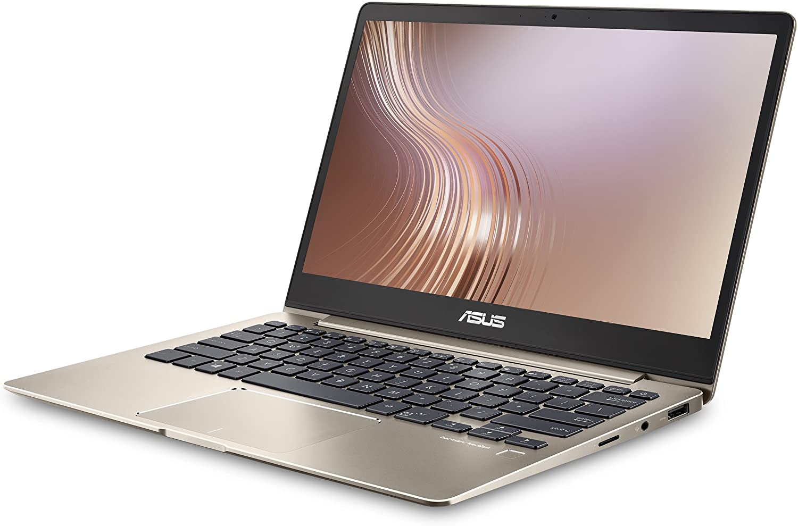
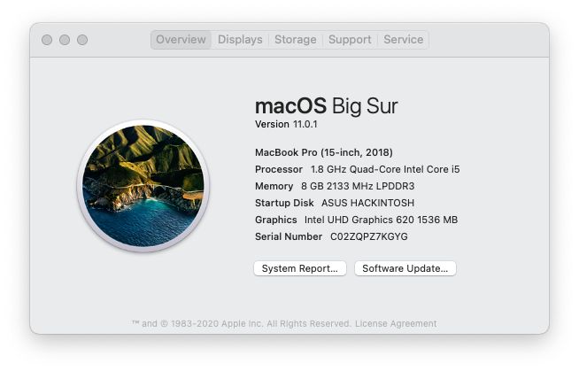

# ASUS Zenbook UX331 OpenCore EFI Hackintosh

# Laptop Specifications

## *ASUS Zenbook UX331FN*
| Hardware                 | Name                                                     |
| ----------- | ----------------------------|
| CPU            | **Intel Core i5-8265U @ 1.60 GHz** |
| GPU    | **Intel UHD Graphics 620, NVIDIA MX150 (*disabled*)** |
| Memory | **8 GB DDR4** |
| Storage | **SanDisk SD7SN6S SATA M.2 256GB** |
| Sound Card     | **Realtek ALC294** |
| Touchpad     | **ELAN1200 I2C HID** |
| WiFi Card     | **Intel Dual Band Wireless-AC 8265** |

## Hardware Compatibility
OpenCore EFI might work with Zenbook models under UX333, but it's **not recommended.**     
Specifically geared towards Zenbooks with Coffee Lake laptop processors.

## Software Compatibility
As of **January 5, 2021**, it works with Mojave and above. Currently updated to `OpenCore 0.6.5`.

## Everything that works perfectly at the moment
| Functions                 | Description                                                     |
| ----------- | ----------------------------|
| Intel Wi-Fi            | `itlwm.kext` works well, but [HeliPort](https://github.com/OpenIntelWireless/HeliPort) is required to run. |
| Bluetooth    | `IntelBluetoothFirmware.kext` is the BT driver added. |
| Sound | `alcid=21` layout ID is the only one that seems to work. Internal mic works. Speakers may not sound properly.  |
| Battery Monitoring | `SSDT-USBX` needed for monitoring battery power for Coffee Lake laptops. |
| Screen Backlight     | `SSDT-PNLF-CFL` fixed backlight control support on Coffee Lake. `BrightnessKeys.kext` for tuning on the screen brightness using keyboard. |
| Fn Keys, Backlit Keyboard     | `AsusSMC` patches in `DSDT` enabled them.  |
| Graphics Acceleration     | `VoodooTSCSync` is required for Coffee Lake. Acceleration works well  |
| Power Management     | `SSDT-PLUG` manages CPU power.   |
| Keyboard     | `VoodooPS2Controller.kext`  |
| Touchpad     | `VoodooI2C.kext`, `VoodooI2CHID.kext` and `SSDT-GPIO` enable the ELAN1200 touchpad. There is a bug where touchpad will sometimes stop working and work after a few minutes |
| Android Tethering     | `HoRNDIS.kext` works with no issues. |
| AirPlay     | **Doesn't work on Big Sur**  |

- Apple Services  
- Sleep
- USB

## Everything that doesn't work
- Ethernet  
- HDMI  
- Webcam
- Touchscreen
- Sidecar

## Not Tested yet
- AirDrop
