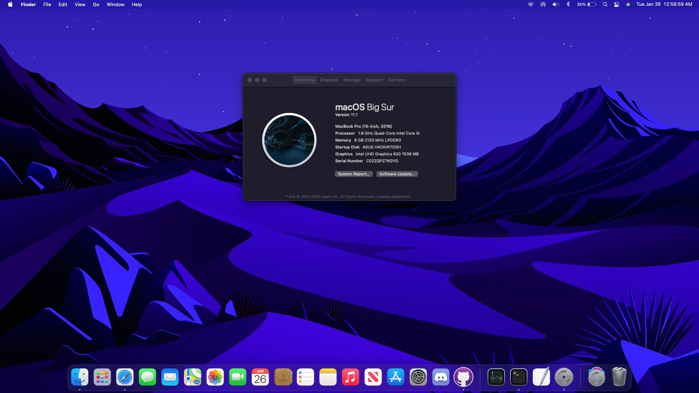

# ASUS Zenbook UX331 Clover/OpenCore EFI Hackintosh

## Hardware Compatibility
Clover and OpenCore might work with Zenbook models under UX333, but it's **not recommended.**     
Specifically geared towards Zenbooks with Coffee Lake laptop processors.

## Software Compatibility
As of now, works with Mojave and Catalina. *Big Sur will be added soon.*

### OpenCore Support (buggy)
Added, but trackpad, and Fn keys are not working yet. At times will freeze after login.

DSDT EFI will work but without battery monitoring.

## Everything that works perfectly at the moment
Intel Wi-Fi (HeliPort)  
Bluetooth  
Audio  
Battery Monitoring  
Power Management  
Internal Microphone  
Brightness  
Keyboard  
Fn Keys  
Apple Services  
Graphics Acceleration   
Sleep   
AirPlay  
USB  

## Everything that works, but is buggy and will sometimes stop
Touchpad  
Touchscreen

## Everything that doesn't work
Ethernet  
Backlit Keyboard  
HDMI  
Webcam

